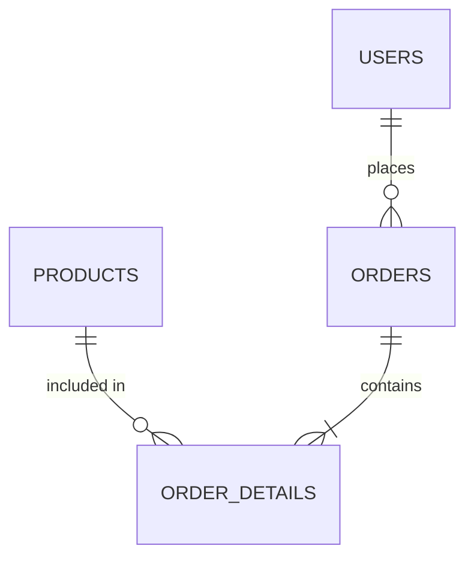

# System Architecture & Database ERD

## 1. Sơ đồ Quan hệ Thực thể (ERD)

```mermaid
erDiagram
    USERS ||--o{ ORDERS : "places"
    PRODUCTS ||--o{ ORDER_DETAILS : "included in"
    ORDERS ||--|{ ORDER_DETAILS : "contains"
```

## 2. Giải thích kiến trúc
- Database cốt lõi thiết kế theo chuẩn chuẩn hóa (3NF).
