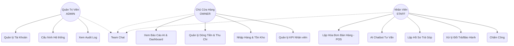
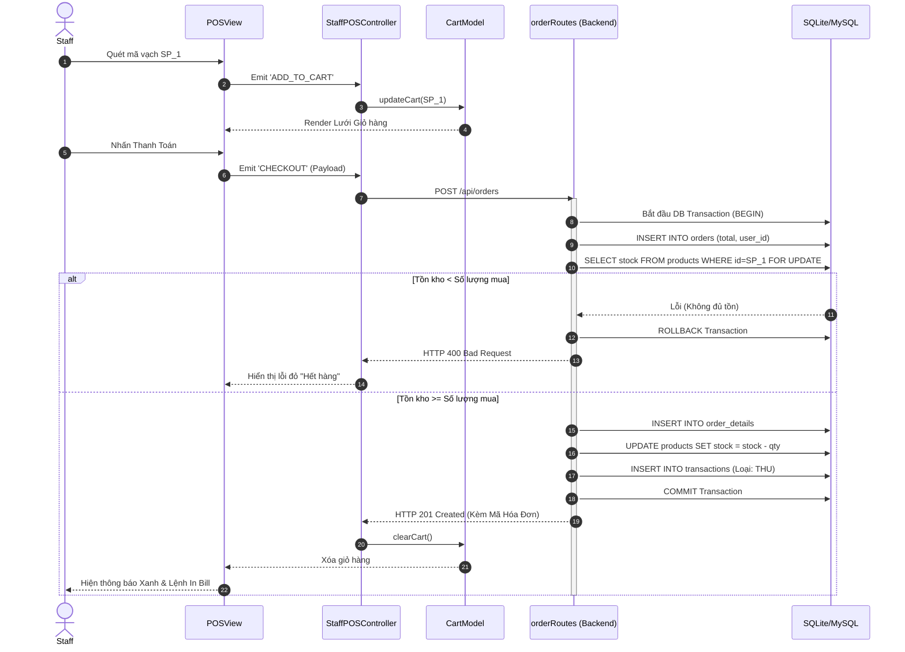
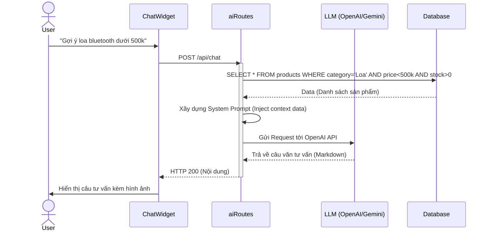

# UML Diagrams Toàn Diện Hệ Thống BanHangAI

## 1. Sơ đồ Use Case Đầy Đủ

```mermaid
flowchart TD
    %% Actors
    Admin((Quản Trị Viên
ADMIN))
    Owner((Chủ Cửa Hàng
OWNER))
    Staff((Nhân Viên
STAFF))

    %% Admin Use Cases
    Admin --> UC_A1(Quản lý Tài Khoản)
    Admin --> UC_A2(Cấu hình Hệ thống)
    Admin --> UC_A3(Xem Audit Log)

    %% Owner Use Cases
    Owner --> UC_O1(Xem Báo Cáo AI & Dashboard)
    Owner --> UC_O2(Quản lý Dòng Tiền & Thu Chi)
    Owner --> UC_O3(Nhập Hàng & Tồn Kho)
    Owner --> UC_O4(Quản lý KPI Nhân viên)

    %% Staff Use Cases
    Staff --> UC_S1(Lập Hóa Đơn Bán Hàng - POS)
    Staff --> UC_S2(AI Chatbot Tư Vấn)
    Staff --> UC_S3(Lập Hồ Sơ Trả Góp)
    Staff --> UC_S4(Xử lý Đổi Trả/Bảo Hành)
    Staff --> UC_S5(Chấm Công)

    %% Common
    Admin -.-> UC_C1(Team Chat)
    Owner -.-> UC_C1
    Staff -.-> UC_C1
```

## 2. Sequence Diagram: Luồng POS & Transaction Trừ Tồn Kho Phức Tạp

```mermaid
sequenceDiagram
    autonumber
    actor Staff
    participant View as POSView
    participant Ctrl as StaffPOSController
    participant Model as CartModel
    participant API as orderRoutes (Backend)
    participant DB as SQLite/MySQL

    Staff->>View: Quét mã vạch SP_1
    View->>Ctrl: Emit 'ADD_TO_CART'
    Ctrl->>Model: updateCart(SP_1)
    Model-->>View: Render Lưới Giỏ hàng
    Staff->>View: Nhấn Thanh Toán
    View->>Ctrl: Emit 'CHECKOUT' (Payload)
    Ctrl->>API: POST /api/orders
    activate API
    
    API->>DB: Bắt đầu DB Transaction (BEGIN)
    
    API->>DB: INSERT INTO orders (total, user_id)
    API->>DB: SELECT stock FROM products WHERE id=SP_1 FOR UPDATE
    
    alt Tồn kho < Số lượng mua
        DB-->>API: Lỗi (Không đủ tồn)
        API->>DB: ROLLBACK Transaction
        API-->>Ctrl: HTTP 400 Bad Request
        Ctrl-->>View: Hiển thị lỗi đỏ "Hết hàng"
    else Tồn kho >= Số lượng mua
        API->>DB: INSERT INTO order_details
        API->>DB: UPDATE products SET stock = stock - qty
        API->>DB: INSERT INTO transactions (Loại: THU)
        API->>DB: COMMIT Transaction
        API-->>Ctrl: HTTP 201 Created (Kèm Mã Hóa Đơn)
        Ctrl->>Model: clearCart()
        Model-->>View: Xóa giỏ hàng
        View-->>Staff: Hiện thông báo Xanh & Lệnh In Bill
    end
    deactivate API
```

## 3. Sequence Diagram: Luồng Hỏi Đáp Trợ Lý AI

```mermaid
sequenceDiagram
    actor User
    participant View as ChatWidget
    participant API as aiRoutes
    participant AI as LLM (OpenAI/Gemini)
    participant DB as Database

    User->>View: "Gợi ý loa bluetooth dưới 500k"
    View->>API: POST /api/chat
    activate API
    API->>DB: SELECT * FROM products WHERE category='Loa' AND price<500k AND stock>0
    DB-->>API: Data (Danh sách sản phẩm)
    API->>API: Xây dựng System Prompt (Inject context data)
    API->>AI: Gửi Request tới OpenAI API
    AI-->>API: Trả về câu văn tư vấn (Markdown)
    API-->>View: HTTP 200 (Nội dung)
    deactivate API
    View->>User: Hiển thị câu tư vấn kèm hình ảnh
```
